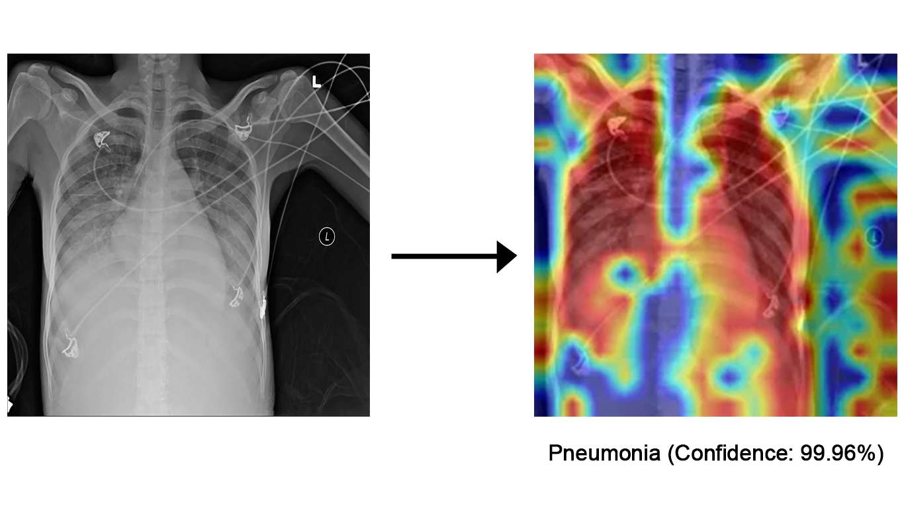

# ViT Pneumonia Classifier

## Project Overview

This project involves the development of a deep learning model for medical image analysis, leveraging recent research advances in self-supervised learning, hybrid architectures, and explainable AI (XAI).

 

## Workflow

1. **Research & Literature Review**
   - Investigated state-of-the-art approaches in medical imaging, including:
     - [ViTs for diseases classification (with self-supervised pre-training)](https://arxiv.org/abs/2203.05573)
     - [Lung segmentation and disease classification pipeline](https://www.ncbi.nlm.nih.gov/pmc/articles/PMC7304013/)
     - [Explainability via Grad-CAM](https://arxiv.org/abs/1610.02391)

2. **Data & Preprocessing**
   - Curated a decent-quality dataset of chest X-rays [(RSNA Challenge)](https://www.kaggle.com/competitions/rsna-pneumonia-detection-challenge/data)
   - Applied augmentations (CLAHE, rotations, flips etc.) and normalization for robustness

3. **Model Development**
   - Selected a pre-trained vision transformer (ViT) as the backbone
   - Fine-tuned using transfer learning with medical imaging data
   - Incorporated ideas from literature (e.g., augmentations for inbalanced dataset)

4. **Explainability (XAI)**
   - Integrated Grad-CAM to visualize model attention
   - Heat map highlighting lung regions indicative of the disease

5. **Demo & Deployment**
   - Built and deployed a Gradio demo for real-time predictions

## Key References  

[Lei Zhou, Huidong Liu, Joseph Bae, et al., 2022. *Self Pre-training with Masked Autoencoders for Medical Image Classification and Segmentation.* arXiv:2203.05573](https://arxiv.org/abs/2203.05573).  

[Hadhoud Y, Mekhaznia T, Bennour A, et al., 2024. *From Binary to Multi-Class Classification: A Two-Step Hybrid CNN-ViT Model for Chest Disease Classification.* PMID: 39682662](https://pubmed.ncbi.nlm.nih.gov/39682662/).  

[Ramprasaath R. Selvaraju, Michael Cogswell, Abhishek Das, et al., 2016. *Grad-CAM: Visual Explanations from Deep Networks via Gradient-based Localization.* arXiv:1610.02391](https://arxiv.org/abs/1610.02391).  

[Zak M, Krzyżak A., 2020. *Classification of Lung Diseases Using Deep Learning Models.* PMCID: PMC7304013](https://www.ncbi.nlm.nih.gov/pmc/articles/PMC7304013/). 

[Radiological Society of North America (RSNA), 2018. *RSNA Pneumonia Detection Challenge.* (Dataset), Kaggle](https://www.kaggle.com/competitions/rsna-pneumonia-detection-challenge/data)

> **Future work**: Creating a full-stack system for this model (in progress), Implementing more metrics (in progress), Longer training (in progress), Creating a pipeline with U-Net for lung segmentation.